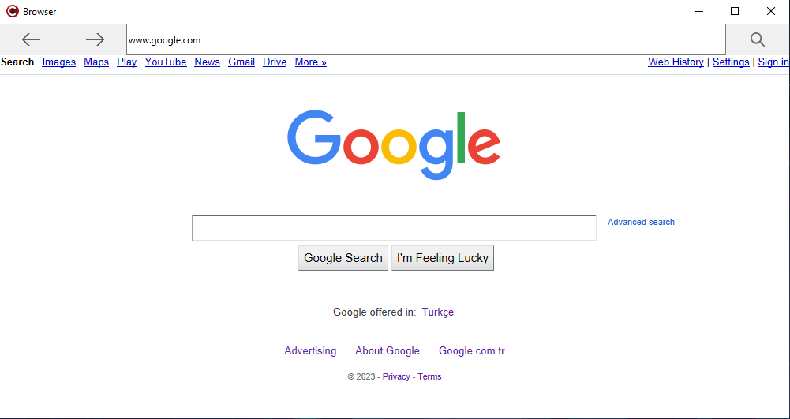

# Browser
This Browser is designed for low-performance systems, it opens pages quickly and efficiently loads web pages.

# Lightweight Browser Project

## Table of Contents

- [Introduction](#introduction)
- [Target Audience](#target-audience)
- [Technology Stack](#technology-stack)
- [Core Features](#core-features)
- [Performance Focus](#performance-focus)
- [Security and Privacy](#security-and-privacy)
- [User Interface](#user-interface)
- [Resource Efficiency](#resource-efficiency)
- [Testing and Feedback](#testing-and-feedback)
- [Contribution Guidelines](#contribution-guidelines)
- [License](#license)

## Introduction

This repository is dedicated to the development of a lightweight web browser designed to perform efficiently on low-performance systems. The browser aims to provide a fast, secure, and user-friendly web browsing experience while minimizing resource usage.

## Target Audience

The primary target audience for this project includes users with low-performance systems, such as old computers, devices with limited bandwidth connections, and IoT devices.

## Technology Stack

The browser will be developed using the following technology stack:
- [Technology 1]
- [Technology 2]
- [Technology 3]

## Core Features

The browser will offer the following core features:
- URL opening
- Page navigation
- Bookmarks
- Tab management

## Performance Focus

Performance optimization is a top priority for this browser project. We will implement techniques like:
- Data compression
- Caching
- Resource management

to ensure fast page loading and efficient system resource usage.

## Security and Privacy

User security and privacy are fundamental concerns for this project. We will:
- Regularly apply security updates
- Implement user-friendly privacy settings

to protect users' data and online activities.

## User Interface

The user interface will be designed to be:
- User-friendly
- Simple
- Free from unnecessary embellishments

Focusing on providing a streamlined and intuitive browsing experience.

## Resource Efficiency

To cater to low-performance systems, the browser will aim for:
- Minimal memory consumption
- Low CPU usage
- Energy efficiency

to extend the life of older hardware.

## Testing and Feedback

We will extensively test the browser on various low-performance systems and actively seek feedback from users. Your feedback will be crucial in continuously improving the browser.

## Contribution Guidelines

We welcome contributions from the open-source community. Please read [CONTRIBUTING.md](CONTRIBUTING.md) for details on how to contribute to this project.

## License

This project is licensed under the [License Name] License. See the [LICENSE.md](LICENSE.md) file for details.

[Optional: Include badges, such as build status, code coverage, or license, at the top of the README.]

[Optional: Include a section for acknowledgments, giving credit to individuals, libraries, or tools that were used or inspired during the development of the project.]

